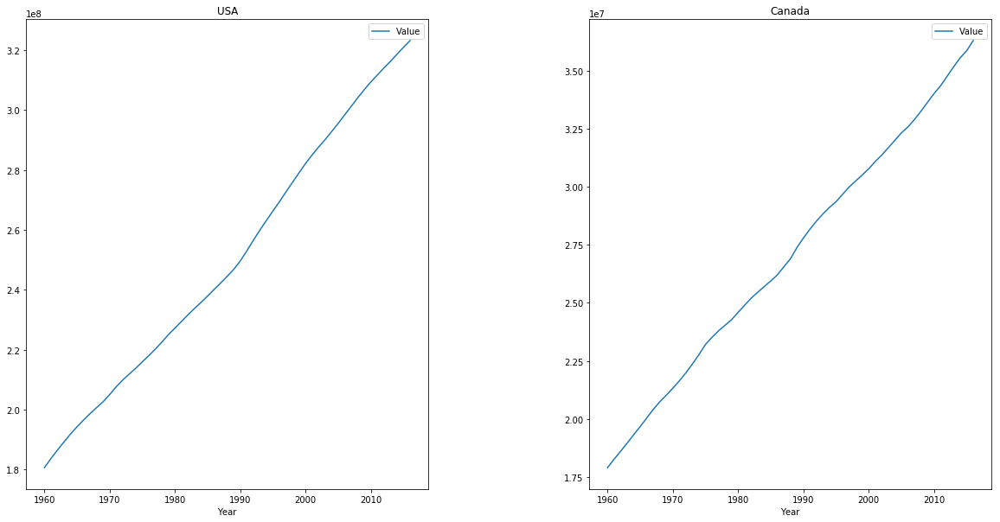
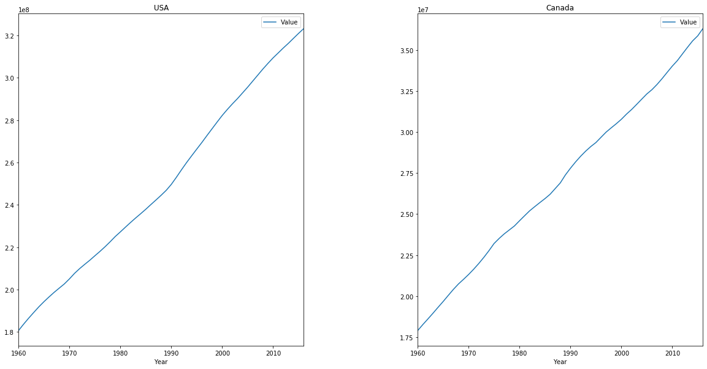

# Subplots and Enumeration - Lab

## Introduction

In this lab, we'll get some practice creating **_subplots_** and explore how we can use the `enumerate` keyword to make creating them a bit easier!

## Objectives

You will be able to:

* Create subplots using a Matplotlib figure
* Use the enumerate function in a for loop to track the index while iterating over a collection

## Getting Started

For this lab, we'll explore a dataset containing yearly population data about different countries and regions around the globe. Let's start by importing the dataset so we can get to work.

In the cell below: 

* Import `pandas` and set the standard alias of `pd` 
* Import the `pyplot` module from `matplotlib` and set the standard alias of `plt` 
* Set matplotlib visualizations to appear inline with the command `%matplotlib inline` 


```python
import pandas as pd
import matplotlib.pyplot as plt
%matplotlib inline
```

Now, let's import the dataset. 

In the cell below:

* Use `pandas` to read in the data stored in the file `'population.csv'` 
* Print the first five rows of the DataFrame to ensure everything loaded correctly and get a feel for what this dataset contains 


```python
# Import the file
df = pd.read_csv('population.csv')
# Print the first five rows 
df.head()
```


<div>
<style scoped>
    .dataframe tbody tr th:only-of-type {
        vertical-align: middle;
    }

    .dataframe tbody tr th {
        vertical-align: top;
    }

    .dataframe thead th {
        text-align: right;
    }
</style>
<table border="1" class="dataframe">
  <thead>
    <tr style="text-align: right;">
      <th></th>
      <th>Country Name</th>
      <th>Country Code</th>
      <th>Year</th>
      <th>Value</th>
    </tr>
  </thead>
  <tbody>
    <tr>
      <th>0</th>
      <td>Arab World</td>
      <td>ARB</td>
      <td>1960</td>
      <td>92490932.0</td>
    </tr>
    <tr>
      <th>1</th>
      <td>Arab World</td>
      <td>ARB</td>
      <td>1961</td>
      <td>95044497.0</td>
    </tr>
    <tr>
      <th>2</th>
      <td>Arab World</td>
      <td>ARB</td>
      <td>1962</td>
      <td>97682294.0</td>
    </tr>
    <tr>
      <th>3</th>
      <td>Arab World</td>
      <td>ARB</td>
      <td>1963</td>
      <td>100411076.0</td>
    </tr>
    <tr>
      <th>4</th>
      <td>Arab World</td>
      <td>ARB</td>
      <td>1964</td>
      <td>103239902.0</td>
    </tr>
  </tbody>
</table>
</div>


Our columns look fairly standard. Let's take a look at the `value_counts()` of the `'Country Name'` column to get a feel for how many years there are per country. 

Do this now in the cell below. 


```python
# Look at the value_counts() of the 'Country Name' column 
df['Country Name'].value_counts()
```


    Arab World                                           57
    Burundi                                              57
    Europe & Central Asia (IDA & IBRD countries)         57
    Low & middle income                                  57
    World                                                57
    Panama                                               57
    Maldives                                             57
    Slovak Republic                                      57
    Honduras                                             57
    Cayman Islands                                       57
    Tanzania                                             57
    Middle East & North Africa                           57
    Peru                                                 57
    Burkina Faso                                         57
    Lao PDR                                              57
    Kosovo                                               57
    Solomon Islands                                      57
    Thailand                                             57
    Guam                                                 57
    Cuba                                                 57
    OECD members                                         57
    Kazakhstan                                           57
    Estonia                                              57
    Botswana                                             57
    British Virgin Islands                               57
    Sub-Saharan Africa (IDA & IBRD countries)            57
    European Union                                       57
    United Kingdom                                       57
    Swaziland                                            57
    New Zealand                                          57
                                                         ..
    Bosnia and Herzegovina                               57
    Fragile and conflict affected situations             57
    Andorra                                              57
    Pre-demographic dividend                             57
    Aruba                                                57
    San Marino                                           57
    Iran, Islamic Rep.                                   57
    Armenia                                              57
    Suriname                                             57
    IBRD only                                            57
    Bangladesh                                           57
    Tajikistan                                           57
    Middle East & North Africa (IDA & IBRD countries)    57
    Mali                                                 57
    Iceland                                              57
    Puerto Rico                                          57
    Small states                                         57
    Djibouti                                             57
    Channel Islands                                      57
    Macedonia, FYR                                       57
    Caribbean small states                               57
    Cote d'Ivoire                                        57
    Central African Republic                             57
    Spain                                                57
    Greece                                               57
    Kuwait                                               54
    Eritrea                                              52
    Serbia                                               27
    West Bank and Gaza                                   27
    Sint Maarten (Dutch part)                            19
    Name: Country Name, Length: 263, dtype: int64


## Groupings and Subplots

When creating subplots, it makes sense that we'll usually want the plots to contain data that is related to one another, so that the subplots will make it easy to visually compare and see trends or patterns. The easiest way to do this is to group our data by the types of information we're most interested in seeing. For this dataset, that means that we can group by `'Country Name'`, by `'Country Code'`, or by `'Year'`. Let's start by grouping by name.

For our first subplot, we'll create 1 row containing 2 subplots. Let's start by getting some data for each of our plots. We'll do this by slicing data for the USA and Canada and storing them in separate variables. 

In the cell below:

* Slice all the rows for '`United States`' and store them in the appropriate variable. 
* Slice all the rows for '`Canada`' and store them in the appropriate variable. 
* Inspect the `head()` of each to ensure that we grabbed the data correctly. 


```python
# Slice all the rows for USA
usa = df[df['Country Name']=='United States']
# Inspect the head of USA
display(usa.head())

# Slice all the rows for Canada
canada = df[df['Country Name']=='Canada']
# Inspect the head of Canada
canada.head()
```


<div>
<style scoped>
    .dataframe tbody tr th:only-of-type {
        vertical-align: middle;
    }

    .dataframe tbody tr th {
        vertical-align: top;
    }

    .dataframe thead th {
        text-align: right;
    }
</style>
<table border="1" class="dataframe">
  <thead>
    <tr style="text-align: right;">
      <th></th>
      <th>Country Name</th>
      <th>Country Code</th>
      <th>Year</th>
      <th>Value</th>
    </tr>
  </thead>
  <tbody>
    <tr>
      <th>14288</th>
      <td>United States</td>
      <td>USA</td>
      <td>1960</td>
      <td>180671000.0</td>
    </tr>
    <tr>
      <th>14289</th>
      <td>United States</td>
      <td>USA</td>
      <td>1961</td>
      <td>183691000.0</td>
    </tr>
    <tr>
      <th>14290</th>
      <td>United States</td>
      <td>USA</td>
      <td>1962</td>
      <td>186538000.0</td>
    </tr>
    <tr>
      <th>14291</th>
      <td>United States</td>
      <td>USA</td>
      <td>1963</td>
      <td>189242000.0</td>
    </tr>
    <tr>
      <th>14292</th>
      <td>United States</td>
      <td>USA</td>
      <td>1964</td>
      <td>191889000.0</td>
    </tr>
  </tbody>
</table>
</div>


<div>
<style scoped>
    .dataframe tbody tr th:only-of-type {
        vertical-align: middle;
    }

    .dataframe tbody tr th {
        vertical-align: top;
    }

    .dataframe thead th {
        text-align: right;
    }
</style>
<table border="1" class="dataframe">
  <thead>
    <tr style="text-align: right;">
      <th></th>
      <th>Country Name</th>
      <th>Country Code</th>
      <th>Year</th>
      <th>Value</th>
    </tr>
  </thead>
  <tbody>
    <tr>
      <th>4617</th>
      <td>Canada</td>
      <td>CAN</td>
      <td>1960</td>
      <td>17909009.0</td>
    </tr>
    <tr>
      <th>4618</th>
      <td>Canada</td>
      <td>CAN</td>
      <td>1961</td>
      <td>18271000.0</td>
    </tr>
    <tr>
      <th>4619</th>
      <td>Canada</td>
      <td>CAN</td>
      <td>1962</td>
      <td>18614000.0</td>
    </tr>
    <tr>
      <th>4620</th>
      <td>Canada</td>
      <td>CAN</td>
      <td>1963</td>
      <td>18964000.0</td>
    </tr>
    <tr>
      <th>4621</th>
      <td>Canada</td>
      <td>CAN</td>
      <td>1964</td>
      <td>19325000.0</td>
    </tr>
  </tbody>
</table>
</div>


Now that our data is ready, lets go ahead and create a basic subplot. For our first batch of subplots, we'll use the quick way by making use of `plt.subplot()` and passing in the number of rows, number of columns, and the number of the subplots that we want to create. Then, we'll create our plot by passing in the corresponding data. 

When we call `plt.subplot()`, it will return an `ax` (short for 'axis') object that corresponds to the third parameter we pass in -- the actual plot we will want to create. To create subplots on the fly with this method, we'll:

1. Get the `ax` object for the first plot in the subplot we want to create. Store this in the variable `ax1` 
2. Call `.plot()` on the `usa` DataFrame, and specify the following parameters:
    * `x='Year'`
    * `y='Value'`
    * `ax=ax1`
3. Use the `ax1` object's methods to do any labeling we find necessary 
4. Repeat the process for `canada` with the second plot. Store this axis in `ax2`   

Do this now in the cell below. 


```python
# Subplot for USA
ax1 = plt.subplot(1, 2, 1)
usa.plot(x='Year', y='Value', ax=ax1)
ax1.set_title("USA")

# Subplot for Canada
ax2 = plt.subplot(1, 2, 2)
canada.plot(x='Year', y='Value', ax=ax2)
ax2.set_title('Canada')
```


    Text(0.5, 1.0, 'Canada')


Our plots look pretty good, but they're a bit squished together, and the plots themselves are much too small, which squishes the axis values.  Both of these problems have an easy fix. We'll begin by using `plt.figure()` and passing in a larger `figsize` of `(20, 10)` to tell matplotlib we want the full subplot to be 20 inches by 10.  

We can fix the spacing quite easily by using `plt.subplots_adjust()` and changing the amount of space in between our plots. The [documentation for `subplots_adjust`](https://matplotlib.org/api/_as_gen/matplotlib.pyplot.subplots_adjust.html) tells us that the parameter we need to adjust is `wspace`. This is set to `0.2` by default, meaning that the amount of space between our plots is equal to 20% of the width of the plots. Let's set `wspace=0.4`, and see how that looks.

In the cell below: 

* Call `plt.figure()` and use the `figsize` parameter to set the size of the total subplot to 20 inches wide by 10 inches tall. Remember to pass these values in as a tuple, with width first and height second  
* Copy the visualization code from the cell above into the cell below  
* After setting the title for the Canada plot, add the line `plt.subplots_adjust()` and pass in the parameter `wspace=0.4` 


```python
# Create figure
plt.figure(figsize=(20, 10))
ax1 = plt.subplot(1, 2, 1)
usa.plot(x='Year', y='Value', ax=ax1)
ax1.set_title("USA")

ax2 = plt.subplot(1, 2, 2)
canada.plot(x='Year', y='Value', ax=ax2)
ax2.set_title('Canada')
plt.subplots_adjust(wspace=0.4)
```





Much better!

Next, we'll see some advanced methods for creating subplots. But, before we do that, let's take a brief detour and learn about the `enumerate` keyword!

## Using `enumerate()`

Python's `enumerate()` keyword is a special type of `for` loop. It works just like a regular `for` loop, with one major difference -- instead of just returning the next object with each iteration of the loop, it also returns the index of the object from the collection we're looping through! 

Run the example code in the cell below, and examine the output. That should make it clear what is happening. 


```python
sample_list = ['foo', 'bar', 'baz']

for index, value in enumerate(sample_list):
    print("Index: {}      Value: {}".format(index, value)) 
```

    Index: 0      Value: foo
    Index: 1      Value: bar
    Index: 2      Value: baz


The `enumerate` keyword is extremely helpful anytime we need to do something that needs the index of the item we're looping through. Let's try an example: 

In the cell below: 
* `enumerate()` through `sample_list_2` 
* For any item in `sample_list_2`, append it to the `odds` list if it's index is an odd number 
* Once the loop has finished, print `odds` 


```python
sample_list_2 = ['item at Index ' + str(i) for i in range(10)]
odds = []

for index, value in enumerate(sample_list_2):
    if index % 2 == 1:
        odds.append(value)
odds
```


    ['item at Index 1',
     'item at Index 3',
     'item at Index 5',
     'item at Index 7',
     'item at Index 9']


Great! There are plenty of situations where `enumerate()` comes in very handy. By allowing us to get the index and the value at the same time, it makes it simple to manipulate one variable based on the value of the other. This is a natural requirement of subplots.

## Enumerating with Subplots

To end this lab, we'll see how we can use `enumerate` to easily subplot this entire DataFrame by country -- all 263 of them!

It will work like this. We'll begin by grouping each row in our DataFrame by `'Country Name'`. Then, we'll create a `plt.figure()` and set the figure size to `(20,40)`. We'll also set the `facecolor` to `'white'`, so that it's a bit easier to read. 

Then comes the fun part. We'll enumerate through our grouped DataFrame. Just looping through a grouped DataFrame returns a tuple containing the index and the rows with that country name. Since we're grouped by `'Country Name'`, this means that the index will actually be the `'Country Name'`. However, we're not just looping through the grouped DataFrame -- we're `enumerate`-ing through it! 

```python
for index, (value1, value2) in enumerate(grouped_DataFrame):
    # index is an integer, starting at 0 and counting up by 1 just 
    # like we would expect a for loop to do
    
    #(value1, value2) is a tuple containing the name of the country as value 1
    # (since it is acting as the index because we grouped everything by it),
    # and value 2 is all the rows that belong to that country's group. 
    
```

This means that the `index` for our enumeration will be an integer value that counts higher by 1 with each country. If we just add 1 to it (because subplots start counting at 1, but Python starts counting at 0), then this number will correspond with the index we need to pass in as the third parameter in `plt.subplot()` -- the parameter that specifies which plot inside the subplot should show the plot we're about to create. 

Don't worry if this seems confusing -- the code below has been commented to help you. 


```python
# Group the DataFrame by Country Name--this line has been provided for you
grouped_df = df.groupby('Country Name')

# pass in figsize=(20,40), and also set the facecolor parameter to 'white'
plt.figure(figsize=(20,40), facecolor="white")

# Complete the line below so that the first loop variable is the called index,
# and the second loop variable is the tuple (countryname, population). 
for index, (countryname, population) in enumerate(grouped_df):
    
    # Get the unique subplot where the plot we're creating during this iteration
    # of the loop will live. Our subplot will be 30 rows of 9 plots each. 
    # Set the third value to be index+1
    ax = plt.subplot(30, 9, index+1)
    
    # Complete the line to create the plot for this subplot
    population.plot(x='Year', y='Value', ax=ax, legend=False)
    
    # Set the title of each plot, so we know which country it represents
    ax.set_title(countryname)
```





Great job! Being able to effectively create subplots with `matplotlib` is a solid data visualization skill to have -- and using `enumerate()` makes our code that much simpler!

## Summary

In this lab, we learned how to create advanced subplots using `enumerate()` on grouped DataFrames!
